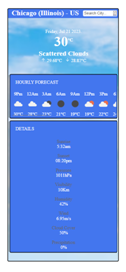
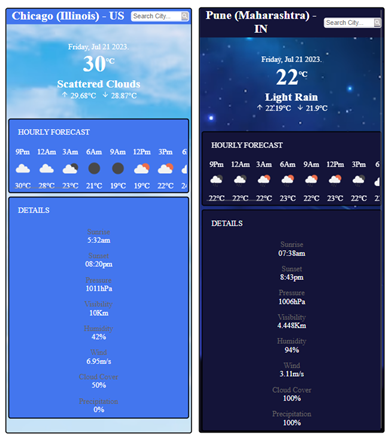

# Weather App


[weatherapp.webm](https://github.com/juhikumarimodi6/React-Weather-App/assets/71226446/fe1234db-9c60-4cb5-a8de-c8fd55e07d56)

The Weather App is a React-based application that provides users with current weather condition details and hourly forecasts to prepare them for upcoming weather conditions. It offers various features to enhance the user experience and make weather information easily accessible.

## Features

1. **Current Weather Display**: View the current weather details at your location.

2. **Location-Based Weather**: Enter a city name in the input box to search for weather details of a specific location.

3. **Geolocation**: Utilize geolocation to automatically fetch weather details based on your current latitude and longitude.

4. **Weather Icons**: Use weather icons to provide visual representation of weather conditions.

5. **Hourly Forecast**: Check the hourly weather forecast to plan your day effectively.

6. **Day/Night Background Image**: Enjoy dynamic background images based on the time of day.

7. **Loading Indicators**: Informative loading indicators while fetching API data.

8. **Responsive Design**: The app is designed to be responsive and usable on screen sizes larger than 200px.

9. **Additional Weather Details**: Find additional weather information like sunrise, sunset, humidity, and visibility.

## Demo

You can watch the demo of the Weather App [here](https://github.com/juhikumarimodi6/React-Weather-App/blob/main/weatherapp.webm).

## Installation

To run the Todo List App locally, follow these steps:

1. Clone this repository or download the project files from GitHub.

2. Open your terminal and navigate to the project directory.

3. Install the required node modules using the following command:

   ```bash
   npm install
   ```

4. Start the development server with the following command:

   ```bash
   npm start
   ```

5. The app should now be running on your local server. Open your web browser and access it at `http://localhost:3000`.

## Usage

By default, the Weather App displays the current weather details of your present location. You can search for weather details of any desired location by typing the city name in the search input box. The app also provides hourly weather details and additional information.

## Technologies Used

The Weather App is built using the following technologies:

- React.js (v18.2)
- CSS
- React hooks (useState, useContext)
- Geolocation
- Library: [react](https://react.dev/learn), [react-icons](https://react-icons.github.io/react-icons/)

## API Usage

The Weather App relies on the following OpenWeatherMap API endpoints:

- To get weather details: `https://api.openweathermap.org/data/2.5/forecast?lat={latitude}&lon={longitude}&appid={API_KEY}&units=metric&cnt=20`
- To get city name in the header: `http://api.openweathermap.org/geo/1.0/reverse?lat={latitude}&lon={longitude}&limit=1&appid={API_KEY}`

## Screenshots



## Contributing

Thank you for considering contributing to the Todo List App! If you find any bugs, have feature requests, or want to submit pull requests, please follow these guidelines:

- Before reporting a bug, check the existing issues to see if it has been reported already.
- When submitting a bug report or feature request, provide detailed information and steps to reproduce the issue.
- For pull requests, explain the changes you made and ensure that the app's functionality and existing tests remain intact.

## Contact Information

Feel free to reach out to me by email at juhikumarimodi6@gmail.com if you have any questions, suggestions, or feedback.

---
